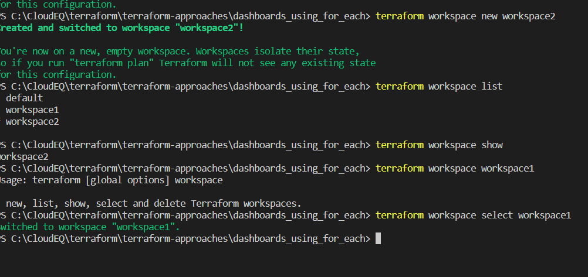

# Terraform workspaces:
   # Command : 
   ## 1: Terraform workspace show 
   ### --> It will show in which workspace we are by default it will be in the default mode 

   ## 2: Terraform workspace new nameoftheworkspace 
   ### --> This will now create a new workspace and it has none resources we need to create all the resources from the start 

   ## 3: Terraform workspace list 
   ### --> This all the available terraform workspaces in terraform and you can switch between them as per the requirement 

   ## 4: terraform workspace select workspace1
   ### --> it will switch to the mentioned workspace 

  # Terraform workspace commands and its results :
   
